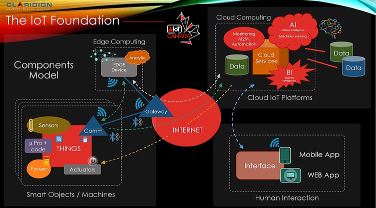

# Chaine IoT: de Raspberry Pico à un tableau de bord Streamlit via MQTT et MongoDB

**Objectif :** intégrer le maximum de concepts du portfolio; construire une chaine calquée sur le modèle d'AioICanada : un objet connecté mesure des données environnementales quelconques et enregistre les données brutes et les statistiques issues de calculs à la pointe (*edge computing*); les données parcourent divers composants pour arriver à un tableau de bord.

## Diagrammes de déploiement

Le protocole WiFi est idéal pour démarrer avec quelques nœuds afin de tester la chaine. Or, dans ce genre de montage, le volume de données est très petit (quelques bits à chaque 10 minutes ou chaque heure, par exemples) et les nœuds peuvent être distribués sur de longues portées. Ces portées nécessitent plusieurs répéteurs WiFi pour acheminer les données vers la passerelle WiFi; ce qui augmente les coûts. Ces portées sont trop longues pour le Bluetooth.
