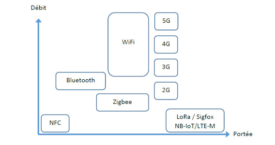
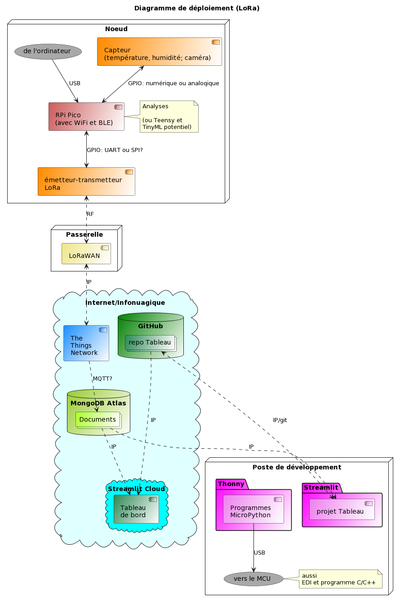

# Chaine IoT: de Raspberry Pico à un tableau de bord Streamlit via MQTT et MongoDB

**Objectif :** intégrer le maximum de concepts du portfolio; construire une chaine calquée sur le modèle d'AioICanada : un objet connecté mesure des données environnementales quelconques et enregistre les données brutes et les statistiques issues de calculs à la pointe (*edge computing*); les données parcourent divers composants pour arriver à un tableau de bord.

## Diagrammes de déploiement

Le protocole WiFi est idéal pour démarrer avec quelques nœuds afin de tester la chaine. Or, dans ce genre de montage, le volume de données est très petit (quelques bits à chaque 10 minutes ou chaque heure, par exemples) et les nœuds peuvent être distribués sur de longues portées. Ces portées nécessitent plusieurs répéteurs WiFi pour acheminer les données vers la passerelle WiFi; ce qui augmente les coûts. Ces portées sont trop longues pour le Bluetooth.

Le protocole idéal est le LoRa. Ce dernier permet de déployer de nombreux nœuds sur une large superficie et de concentrer les faibles volumes de données sur une seule passerelle sans utiliser des répéteurs.

## Application générale

La valeur provient de la gestion de données. Les données captées et les autres données obtenues par calculs à la pointe ou calculs dans le tableau de bord permettent de renseigner les utilisateurs; les usages sont nombreux: mesures automatisées, contrôles des états, de la qualité, prévention des pertes, d'accidents, alertes, etc.

## Exemple d'application

Implanter le projet dans le contrôle de la réfrigération. Des organismes sans buts lucratifs recueillent des denrées pour les redonner. Ces organismes fonctionnent aussi avec des dons d'équipements, car ils utilisent des appareils de réfrigération récupérés dans des épiceries. Ces appareils en fin de vie peuvent briser à tout moment. Il faut contrôler la température pour éviter de perdre inutilement des denrées. Les capteurs de température dans les appareils de réfrigération représentent les noeuds. Un tableau de bord (page web) montre ces données à partir d'un PC dans les locaux administratifs des organismes. Le dispositif montre des données brutes, des statistiques et des alertes. Le tableau de bord permet aux organismes de suivre la situation à toute heure et de limiter leurs pertes avec les alertes (une température qui passe un seuil ou qui augmente rapidement).
