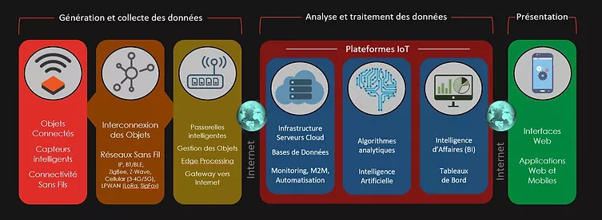

# Chaine IoT: de Raspberry Pico à un tableau de bord Streamlit via MQTT et MongoDB

Le projet est une chaine calquée sur le modèle d'AIoICanada : un objet connecté collecte des données environnementales quelconques, enregistre les données brutes et dérive des statistiques issues de calculs à la pointe (*edge computing*); les statistiques parcourent divers composants pour arriver à une instance centrale qui stocke les données dans une base de données et les présente dans un tableau de bord sur un site web, par exemple.

Cette architecture en réseau permet de décentraliser le traitement des données pour d'éviter de surcharger les communications. La majorité des calculs se font sur chaque noeud dans le réseau. Chaque noeud communique un résultat à une instance central. Si les données brutes sont des températures enregistrées à chaque 10s, les statistiques peuvent être des températures moyennes communiquées à chaque heure. 

Avec un exemple plus avancé impliquant de l'IA, chaque noeud se charge de transformer les images captées par une caméra embarquée en nombres discrets (0, rien ; 1, présent ; 2, surplus ; etc.). Le noeud ne fait que communiquer un état (0, 1, 2, etc.) à l'instance centrale.

## Mise en place et structure

Un aperçu de la structure avec un Wi-Fi.

## Organisation du répertoire et exécution

À défaut de tout documenter, voici le point d'arrivée: un tableau de bord Streamlit (bouton droit vers : <a href="https://toucan-fortune-streamlit-projet-integrateur-01-accueil-0fsbkp.streamlit.app/" target="_blank">site</a>).

La page Accueil du site offre une description et plus de diagrammes de déploiement.

## Application générale

La valeur provient de la gestion de données. Les données captées et les autres données obtenues par calculs à la pointe ou calculs dans le tableau de bord permettent de renseigner les utilisateurs ; les usages sont nombreux: mesures automatisées, contrôles des états, de la qualité, prévention des pertes, d'accidents, alertes, etc.

### Exemple d'application

Implanter le projet dans le contrôle de la réfrigération. Des organismes sans buts lucratifs recueillent des denrées pour les redonner. Ces organismes fonctionnent aussi avec des dons d'équipements, car ils utilisent des appareils de réfrigération récupérés dans des épiceries. Ces appareils en fin de vie peuvent briser à tout moment. Il faut contrôler la température pour éviter de perdre inutilement des denrées. Les capteurs de température dans les appareils de réfrigération représentent les noeuds. Un tableau de bord (page web) montre ces données à partir d'un PC dans les locaux administratifs des organismes. Le dispositif montre des données brutes, des statistiques et des alertes. Le tableau de bord permet aux organismes de suivre la situation à toute heure et de limiter leurs pertes avec les alertes (une température qui passe un seuil ou qui augmente rapidement).
